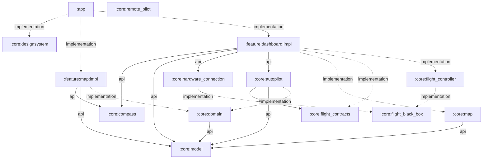

# Shahbaz

Shahbaz is an Android flight-planning and monitoring app. The setup flow captures the phone's
precise takeoff position, a destination, a positive cruise altitude above takeoff, and the signed
destination-ground elevation relative to takeoff. Confirming that profile opens a flight dashboard
that first establishes a validated native-USB Protocol v2 session with the Shahbaz interface
board, then presents external environmental telemetry, autonomous-mission status, phone
orientation, and a compact route map.

## Using the app

1. Launch Shahbaz and grant **Precise** location access.
2. Wait for the origin marker to appear at the phone's current position.
3. Long-press the map, or use the edit action, to enter a destination in decimal-degree latitude and longitude.
4. Read the WGS-84 distance, then select **Next** below the route details.
5. Enter a **cruise altitude above takeoff** greater than zero meters.
6. Enter the destination ground elevation relative to takeoff: `0` for the same level, a positive
   value for higher ground, or a negative value for lower ground. It must be below cruise altitude.
7. Use **Previous** to correct the destination without losing the drafts. Changing the destination
   retains cruise altitude but clears its ground elevation; select the second **Next** only after
   both values are valid to freeze the flight plan and open the dashboard.
8. Connect the Shahbaz interface board over USB and approve Android's USB-device prompt. The
   dashboard remains blocked until TimeSync, board validation, heartbeat recovery, and the exact
   telemetry-start acknowledgement have all succeeded.
9. Select **Start** to submit a mission-start request. A plan inside the configured static mission
   envelope enters fail-closed autopilot preflight; a plan outside it remains in Standby with its
   blocker visible. The button never arms motors directly, and missing or unsafe live prerequisites
   prevent the state machine from advancing to arming.

The current dashboard shows SHT30 temperature/humidity; MS5611 pressure, QNH-derived altitude,
and takeoff-relative altitude; phone compass/cardinal deviations; and display-corrected X/Y/Z
orientation. Every instrument identifies whether its source is the external USB board or an
internal phone sensor and reports waiting, unavailable, no-response, stale, degraded, error, and
live states explicitly. Its mission controls reflect autopilot state: **Start** dispatches preflight,
an active mission exposes **Abort** and **E-STOP**, and the leading blocking issue is shown beside
the controls.

The currently supported interface-board firmware profile is sensor-only and advertises no active actuator
channels. No production landing detector or route/airspace, landing-zone, energy, geofence, and
wind-safety providers are connected either. Protocol v2 now transports one coherent four-motor
generation, which both ends validate completely before submission; any board-side apply failure
forces all outputs safe. This closes the earlier partial-USB-frame update path, but does not prove
simultaneous hardware-register latching or flightworthiness. Consequently, the current app remains
in preflight after Start and cannot arm or conduct a physical flight. The implemented controls and
runtime path are an integration boundary, not a claim that Shahbaz is flight-qualified.

Android actuator transmission is additionally compiled closed by default. The deliberate developer
property `-Pshahbaz.experimentalPhysicalActuators=true` can open only that Android-side experimental
gate; firmware evidence/configuration gates and all live preflight prerequisites still apply.

Use the recenter control at any time to return the camera to the current location. Clearing the
destination resets the route and both altitude inputs.

The compass reports the device orientation through the reusable, UI-free `:compass` library. The map feature prefers true-north heading after a valid location fix and falls back to magnetic north when geomagnetic correction is unavailable. Location and compass updates stop while the app is in the background.

## Map setup

Shahbaz renders OpenStreetMap data with MapLibre and the public OpenFreeMap Liberty style. No map API key or billing account is required.

Run the app on an API 31+ device or a Google Play-enabled emulator, connect it to the internet, and grant **Precise** location when Android asks. Map attribution remains visible in the lower map area as required by the data providers.

Map tiles require internet access. GPS can still provide a coordinate while offline, and the UI reports when online map content is unavailable.

## Architecture

Shahbaz follows a scaled-down Now in Android-style structure: the application module assembles a feature implementation and focused core modules, while reusable logic points inward and never depends on the app or feature layer.



Solid arrows are `api` dependencies whose public types are visible to consumers. Dashed arrows are internal `implementation` dependencies.

| Module | Role |
| --- | --- |
| [`:app`](app/README.md) | Deployable Android shell, launcher activity, permissions, lifecycle, and top-level Compose wiring. |
| [`:feature:map:impl`](feature/map/impl/README.md) | Complete map journey, UI state, MapLibre rendering, device location, geocoding, and connectivity behavior. |
| [`:feature:dashboard:impl`](feature/dashboard/impl/README.md) | Post-setup dashboard, connection gate, mission intent/status presentation, runtime integration boundary, external/internal sensors, and 70/30 instrument/map layout. |
| [`:core:hardware_connection`](core/hardware_connection/README.md) | Transferable, UI-free Android USB-host/Protocol v2 library; owns USB permission, link lifecycle, session validation, and typed board telemetry. |
| [`:core:flight_contracts`](core/flight_contracts/README.md) | Pure-Kotlin immutable contract values shared by autonomous policy and composition adapters without coupling flight implementations. |
| [`:core:flight_controller`](core/flight_controller/README.md) | Independent Kotlin flight-controller engine; fuses phone/board sensor input, gates arming, runs PX4-inspired multicopter control loops, and emits neutral actuator commands. |
| [`:core:autopilot`](core/autopilot/README.md) | Fail-closed point-to-point mission policy; sequences preflight, takeoff, cruise, landing/touchdown, disarm, abort-to-origin, and emergency behavior into flight-controller commands. |
| [`:core:remote_pilot`](core/remote_pilot/README.md) | Reserved future remote-pilot module for operator input handling and conversion of pilot intent into flight-controller targets. |
| [`:core:map`](core/map/README.md) | Reusable compact route map for fixed endpoints and an optional current-position marker. |
| [`:core:compass`](core/compass/README.md) | Standalone, UI-free Android library for display-corrected orientation, magnetic/true-north headings, direction/deviation calculations, accuracy, and calibration state. |
| [`:core:model`](core/model/README.md) | Android-free geographic value objects shared across layers. |
| [`:core:domain`](core/domain/README.md) | Android-free geodesy, coordinate parsing, and distance-formatting rules. |
| [`:core:designsystem`](core/designsystem/README.md) | Shahbaz Compose theme, color tokens, and typography. |

### Dependency rules

- `:app` is the composition root and may depend on feature and core modules.
- Feature modules may depend on core modules, but core modules never depend on features or `:app`.
- `:core:compass` is a standalone Android library and does not depend on Shahbaz feature, app, model, domain, or design-system modules.
- `:core:hardware_connection` is a standalone Android library with no dependency on any Shahbaz app
  or feature module. It contains no UI, owns all board USB mechanics, and records through
  `:core:flight_black_box`.
- `:core:flight_controller` is a standalone Android library with no dependency on the app,
  feature modules, or hardware connection. It consumes neutral sensor snapshots, records through
  `:core:flight_black_box`, and emits neutral actuator actions.
- `:core:autopilot` is a standalone Android library whose public contract exposes shared model and
  neutral `:core:flight_contracts` types. It does not import the flight-controller implementation.
  `:core:remote_pilot` remains reserved. Neither depends on
  `:core:hardware_connection`, so pilot policy cannot bypass the flight-controller boundary.
- The application/dashboard runtime adapter is the composition boundary: it serializes autopilot
  and flight-controller steps, translates their neutral outputs to the one hardware connection,
  and publishes mission snapshots. Neither core engine knows about Compose or USB.
- `:core:domain` and `:core:model` remain plain Kotlin/JVM modules so their rules can be tested without Android.
- `api` is reserved for types present in a module's public contract; implementation details use `implementation`.
- The map remains a single `impl` module because Shahbaz has one feature and no cross-feature navigation contract.

Each module README documents its public surface, resource ownership, usage, and focused verification commands.

### Compass integration

`:feature:map:impl` creates and controls the `Compass` instance, publishes `CompassReading` in `MapUiState`, and supplies accepted location fixes as geomagnetic positions so the library can calculate true-north values. The feature owns the Compose compass presentation and localized direction labels; `:core:compass` contains no UI or localized resources.

The compass library owns its optional compass/accelerometer hardware declarations and requires no runtime permission. A different Android module can consume it directly with `implementation(projects.core.compass)`; see the [`:core:compass` guide](core/compass/README.md) for its lifecycle and public API.

## Build and verification

The build requires JDK 17 or newer, matching the baseline used by the reference Now in Android
project.

Build and run all local JVM and Android checks from the repository root:

```powershell
.\gradlew.bat clean :core:compass:testDebugUnitTest :core:model:test :core:domain:test `
  :core:flight_contracts:test `
  :core:map:testDebugUnitTest :core:hardware_connection:testDebugUnitTest `
  :core:flight_controller:testDebugUnitTest :core:autopilot:testDebugUnitTest `
  :feature:map:impl:testDebugUnitTest :feature:dashboard:impl:testDebugUnitTest `
  :app:testDebugUnitTest lintDebug assembleDebug --no-daemon
```

Verify and package the reusable compass release independently:

```powershell
.\gradlew.bat :core:compass:testDebugUnitTest :core:compass:lintDebug :core:compass:assembleRelease --no-daemon
```

Verify and package the independent hardware connection library:

```powershell
.\gradlew.bat :core:hardware_connection:testDebugUnitTest :core:hardware_connection:lintDebug `
  :core:hardware_connection:assembleRelease --no-daemon
```

Verify and package the independent flight-controller library:

```powershell
.\gradlew.bat :core:flight_controller:testDebugUnitTest :core:flight_controller:lintDebug `
  :core:flight_controller:assembleRelease --no-daemon
```

Verify and package the autonomous mission-policy library:

```powershell
.\gradlew.bat :core:autopilot:testDebugUnitTest :core:autopilot:lintDebug `
  :core:autopilot:assembleRelease --no-daemon
```

Install the debug application on a connected device or running emulator:

```powershell
.\gradlew.bat :app:installDebug
```

Connected instrumentation tests require a device or emulator:

```powershell
.\gradlew.bat :app:connectedDebugAndroidTest
```

GPS-off, permission-denied, approximate-only permission, offline-map, altitude-profile navigation,
USB attach/detach and permission denial, wrong-board rejection, sensor silence/failure/recovery,
orientation accuracy/calibration, and display rotation are best verified on physical hardware.
