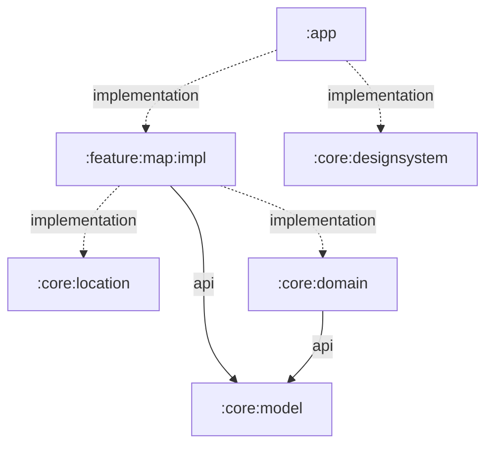

# Shahbaz

Shahbaz is a single-screen Android map app that finds the phone's precise current location, lets the user choose a destination by long-pressing the map or entering latitude/longitude in a dialog, shows the straight-line WGS-84 distance between the two points, and collects the drone's flight-start altitude above its takeoff surface.

## Using the app

1. Launch Shahbaz and grant **Precise** location access.
2. Wait for the origin marker to appear at the phone's current position.
3. Long-press the map, or use the edit action, to enter a destination in decimal-degree latitude and longitude.
4. Read the WGS-84 distance, then select **Next** below the route details.
5. Enter a flight-start altitude greater than zero meters. This is the height the drone should climb above its local takeoff surface before moving toward the destination.
6. Use **Previous** to correct the destination without losing the altitude draft, or select the second **Next** to confirm the altitude.

Use the recenter control at any time to return the camera to the current location. Clearing the destination resets the route and altitude workflow.

The compass reports the device heading when a rotation-vector sensor is available. Location and compass behavior are designed to stop while the app is in the background.

## Map setup

Shahbaz renders OpenStreetMap data with MapLibre and the public OpenFreeMap Liberty style. No map API key or billing account is required.

Run the app on an API 31+ device or a Google Play-enabled emulator, connect it to the internet, and grant **Precise** location when Android asks. Map attribution remains visible in the lower map area as required by the data providers.

Map tiles require internet access. GPS can still provide a coordinate while offline, and the UI reports when online map content is unavailable.

## Architecture

Shahbaz follows a scaled-down Now in Android-style structure: the application module assembles a feature implementation and focused core modules, while reusable logic points inward and never depends on the app or feature layer.



Solid arrows are `api` dependencies whose public types are visible to consumers. Dashed arrows are internal `implementation` dependencies.

| Module | Role |
| --- | --- |
| [`:app`](app/README.md) | Deployable Android shell, launcher activity, permissions, lifecycle, and top-level Compose wiring. |
| [`:feature:map:impl`](feature/map/impl/README.md) | Complete map journey, UI state, MapLibre rendering, device location, geocoding, and connectivity behavior. |
| [`:core:model`](core/model/README.md) | Android-free geographic value objects shared across layers. |
| [`:core:domain`](core/domain/README.md) | Android-free geodesy, heading, parsing, and formatting rules. |
| [`:core:location`](core/location/README.md) | Android sensor adapter for display-corrected device heading updates. |
| [`:core:designsystem`](core/designsystem/README.md) | Shahbaz Compose theme, color tokens, and typography. |

### Dependency rules

- `:app` is the composition root and may depend on feature and core modules.
- Feature modules may depend on core modules, but core modules never depend on features or `:app`.
- `:core:domain` and `:core:model` remain plain Kotlin/JVM modules so their rules can be tested without Android.
- `api` is reserved for types present in a module's public contract; implementation details use `implementation`.
- The map remains a single `impl` module because Shahbaz has one feature and no cross-feature navigation contract.

Each module README documents its public surface, resource ownership, usage, and focused verification commands.

## Build and verification

The build requires JDK 17 or newer, matching the baseline used by the reference Now in Android
project.

Build and run all local JVM and Android checks from the repository root:

```powershell
.\gradlew.bat :core:model:test :core:domain:test testDebugUnitTest lintDebug assembleDebug --no-daemon
```

Install the debug application on a connected device or running emulator:

```powershell
.\gradlew.bat :app:installDebug
```

Connected instrumentation tests require a device or emulator:

```powershell
.\gradlew.bat :app:connectedDebugAndroidTest
```

GPS-off, permission-denied, approximate-only permission, offline-map, long-press, altitude entry, Previous/Next navigation, geocoding, recenter, and compass behavior are best verified on a physical device.
