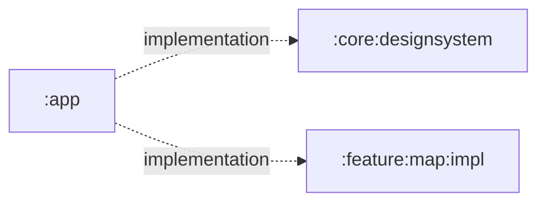

# `:app`

The deployable Android application and composition root for Shahbaz. It connects Android lifecycle and permission APIs to the map feature, applies the shared design system, and owns application-level resources.

## Responsibilities

- Declare the application ID, launcher activity, and application-level metadata.
- Request coarse and fine location permission and open app or device location settings when requested by the feature UI.
- Create `MapViewModel`, collect its `StateFlow`, and pass state and event callbacks to `MapScreen`.
- Forward foreground and background lifecycle events so location and heading work stops when the app is not visible.
- Apply `ShahbazTheme` around the app content.
- Package the final APK. Map behavior, geodesy, sensor calculations, and reusable styling belong to their owning feature or core modules.

## Directory and package structure

| Path | Ownership |
| --- | --- |
| `src/main/kotlin/ir/hrka/shahbaz/MainActivity.kt` | Launcher activity and top-level Compose wiring in package `ir.hrka.shahbaz`. |
| `src/main/AndroidManifest.xml` | Application metadata and launcher intent. Feature permissions merge in from their owning module. |
| `src/main/res/mipmap-*` and `drawable/` | Launcher icon assets. |
| `src/main/res/values/` | Application name and platform launch theme. |
| `src/main/res/xml/` | Backup and data-extraction policy. |
| `src/test/` | App-local JVM tests. |
| `src/androidTest/` | Connected app/instrumentation tests. |

The Gradle namespace and application ID are both `ir.hrka.shahbaz`.

## Public entry points

- `MainActivity` is the exported Android launcher entry point. It is started by Android rather than called as a library API.
- The generated debug APK is the module's distributable output.

## Dependency direction



`:app` is a terminal consumer. No core or feature module may depend on it.

## Using this module

Developers run this module to exercise the complete product. New app-wide Android integration belongs here; map-specific behavior should be added to `:feature:map:impl` instead.

```powershell
.\gradlew.bat :app:installDebug
```

Android Studio should use the `app` run configuration and an API 31+ device or emulator.

## Resource ownership

This module owns launcher icons, the application label, application/activity manifest declarations, backup rules, and the platform XML theme used while the activity starts. Map permissions, optional hardware declarations, copy, and feature UI resources live in `:feature:map:impl`. Compose colors and typography live in `:core:designsystem`.

## Test and build

```powershell
.\gradlew.bat :app:testDebugUnitTest :app:lintDebug :app:assembleDebug
```

Run connected tests with a device or emulator:

```powershell
.\gradlew.bat :app:connectedDebugAndroidTest
```

Permission, settings, activity lifecycle, GPS, network, and sensor flows should also be exercised on a physical device.
