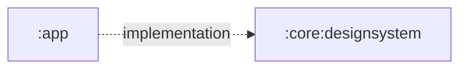

# `:core:designsystem`

The shared Compose visual foundation for Shahbaz. It owns the application theme and reusable design tokens without depending on an app or feature module.

## Responsibilities

- Define light and dark Material 3 color schemes.
- Define the Shahbaz typography baseline.
- Provide the `ShahbazTheme` composition wrapper.
- Provide responsive Canvas compass and aircraft-attitude instruments.
- Optionally select Android dynamic color when a caller enables it.
- Keep product-wide visual tokens out of individual feature implementations.

## Directory and package structure

| Path | Ownership |
| --- | --- |
| `src/main/kotlin/ir/hrka/shahbaz/core/designsystem/Color.kt` | Shared color tokens. |
| `src/main/kotlin/ir/hrka/shahbaz/core/designsystem/Type.kt` | Material typography definition. |
| `src/main/kotlin/ir/hrka/shahbaz/core/designsystem/Theme.kt` | Light/dark schemes and `ShahbazTheme`. |
| `src/main/kotlin/ir/hrka/shahbaz/core/designsystem/compass/CompassView.kt` | Animated magnetic compass presentation. |
| `src/main/kotlin/ir/hrka/shahbaz/core/designsystem/attitude/AttitudeIndicatorView.kt` | Animated pitch-and-roll attitude presentation. |

The Android namespace and Kotlin package are `ir.hrka.shahbaz.core.designsystem`.

## Public entry points

- `ShahbazTheme(darkTheme, dynamicColor, content)` supplies the product `MaterialTheme`.
- `CompassView(heading, modifier, contentDescription)` draws a scalable compass dial.
- `AttitudeIndicatorView(pitchDegrees, rollDegrees, modifier, contentDescription)` draws a scalable aircraft attitude indicator.
- `Typography` is the shared Material typography set.
- `Forest80`, `Sky80`, `Amber80`, `Forest40`, `Sky40`, and `Amber40` are the current public color tokens.

Prefer consuming colors and typography through `MaterialTheme`; use raw tokens only when defining reusable design-system components.

## Dependency direction



The module has no project dependencies. It exposes the Compose BOM, Material 3, and Compose graphics as `api` dependencies because their types appear in its public Compose surface.

## Using this module

```kotlin
dependencies {
    implementation(projects.core.designsystem)
}
```

```kotlin
ShahbazTheme {
    AppContent()
}
```

The app currently keeps dynamic color disabled by default so the Shahbaz palette is stable.

## Resource ownership

All current design tokens are Kotlin declarations; this module owns no XML resources. The platform launch theme and launcher assets remain in `:app`. Feature strings and map-specific visuals remain in `:feature:map:impl`.

## Test and build

```powershell
.\gradlew.bat :core:designsystem:testDebugUnitTest :core:designsystem:lintDebug :core:designsystem:assembleDebug
```

Module-local JVM tests cover compass and attitude-angle normalization and shortest-path animation rules. Theme and instrument changes should still be inspected through `:app` on physical hardware because local tests cannot validate sensor direction or Canvas rendering.
