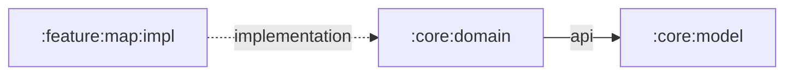

# `:core:domain`

The Android-free geographic rules used by Shahbaz. It performs geodesic calculations and deterministic parsing or formatting without knowing about screens, resources, sensors, or lifecycle.

## Responsibilities

- Calculate WGS-84 ellipsoidal distance with a finite antipodal fallback.
- Calculate Haversine distance and spherical midpoints.
- Parse and format decimal-degree coordinates.
- Format human-readable meter/kilometer distances.
- Keep deterministic business rules independently testable on the JVM.

## Directory and package structure

| Path | Ownership |
| --- | --- |
| `src/main/kotlin/ir/hrka/shahbaz/core/domain/GeoMath.kt` | Distance, midpoint, and distance-formatting rules. |
| `src/main/kotlin/ir/hrka/shahbaz/core/domain/GeoCoordinateFormatter.kt` | Coordinate parser and fixed-precision formatter. |
| `src/test/kotlin/ir/hrka/shahbaz/core/domain/` | JVM tests for ordinary, boundary, antimeridian, antipodal, locale, and invalid-input cases. |

All production declarations use package `ir.hrka.shahbaz.core.domain`.

## Public entry points

- `wgs84GeodesicDistanceMeters(start, end)` calculates the shortest WGS-84 surface distance.
- `haversineDistanceMeters(start, end)` calculates a spherical great-circle distance.
- `sphericalMidpoint(first, second)` returns the midpoint of the shorter great-circle arc.
- `parseCoordinatePair(input)` and `formatCoordinate(coordinate)` convert between text and `GeoCoordinate`.
- `formatDistance(distanceMeters)` renders meters below 1 km and kilometers otherwise.

Compass directions, heading normalization, and angular deviations belong to the standalone `:compass` Android library rather than this geographic domain module.

## Dependency direction



The `api` edge makes `GeoCoordinate` part of this module's public signatures. `:core:domain` must remain independent of Android and feature code.

## Using this module

```kotlin
dependencies {
    implementation(projects.core.domain)
}
```

```kotlin
val destination = parseCoordinatePair("35.6892, 51.3890")
val meters = destination?.let { wgs84GeodesicDistanceMeters(origin, it) }
```

Callers own localization and resource selection around these deterministic primitives. Current numeric formatting intentionally uses a stable US decimal separator.

## Resource ownership

This pure JVM module owns no Android resources. Validation messages are programming-contract messages, not localized UI copy. Feature-facing labels and error text belong to `:feature:map:impl`.

## Test and build

```powershell
.\gradlew.bat :core:domain:test :core:domain:build
```

Add focused JVM tests for numeric edge cases whenever a formula, input syntax, or formatting rule changes.
