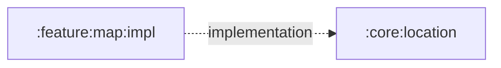

# `:core:location`

The Android sensor adapter for device heading. It turns rotation-vector sensor readings into display-corrected, smoothed compass headings for feature modules.

## Responsibilities

- Detect whether a rotation-vector sensor is available.
- Register and unregister the sensor listener at the caller's request.
- Correct the sensor coordinate system for the current display rotation.
- Normalize heading values to `0..<360` degrees.
- Smooth circular heading changes and throttle callbacks.
- Avoid owning activity lifecycle; callers explicitly start and stop collection.

## Directory and package structure

| Path | Ownership |
| --- | --- |
| `src/main/kotlin/ir/hrka/shahbaz/core/location/HeadingProvider.kt` | Sensor and display integration in package `ir.hrka.shahbaz.core.location`. |

The Android namespace is `ir.hrka.shahbaz.core.location`.

## Public entry points

- `HeadingProvider(context)` creates an application-context-backed sensor adapter.
- `HeadingProvider.isAvailable` reports rotation-vector sensor availability.
- `HeadingProvider.start(onHeadingChanged)` begins callbacks in degrees.
- `HeadingProvider.stop()` releases the listener and clears accumulated state.

Callers must balance every active period with `stop()` and should not assume all devices contain a compass-capable sensor.

## Dependency direction



`:core:location` has no project dependencies and must not depend on a feature or `:app`.

## Using this module

```kotlin
dependencies {
    implementation(projects.core.location)
}
```

Create the provider with an Android `Context`, inspect `isAvailable`, call `start` only while the consumer is active, and call `stop` when it becomes inactive. `:feature:map:impl` currently performs that lifecycle coordination through `MapViewModel`.

## Resource ownership

This module owns no resources or manifest declarations. It exposes sensor capability as data; the consuming feature owns user-facing fallback text and visuals. The app manifest declares the compass as optional hardware.

## Test and build

```powershell
.\gradlew.bat :core:location:testDebugUnitTest :core:location:lintDebug :core:location:assembleDebug
```

There are currently no module-local tests. Display rotation, sensor absence, callback smoothing, and lifecycle behavior require targeted fakes or physical-device validation when changed.
