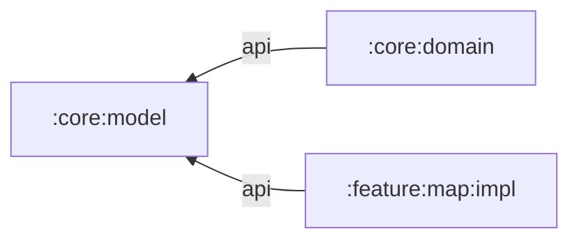

# `:core:model`

The smallest shared model layer. It contains Android-free value objects that can cross module boundaries without pulling in UI, platform, or data-source dependencies.

## Responsibilities

- Represent a latitude/longitude pair in decimal degrees.
- Enforce finite values and the inclusive geographic ranges at construction time.
- Represent a confirmed flight as fixed origin/destination coordinates and a positive target height
  above the takeoff surface.
- Provide stable shared types for domain calculations and cross-feature handoff.
- Remain a plain Kotlin/JVM module with no Android or Compose dependency.

## Directory and package structure

| Path | Ownership |
| --- | --- |
| `src/main/kotlin/ir/hrka/shahbaz/core/model/GeoCoordinate.kt` | Production model in package `ir.hrka.shahbaz.core.model`. |
| `src/main/kotlin/ir/hrka/shahbaz/core/model/FlightPlan.kt` | Immutable validated setup snapshot shared with flight monitoring. |
| `src/test/kotlin/ir/hrka/shahbaz/core/model/GeoCoordinateTest.kt` | Boundary, range, and non-finite input tests. |
| `src/test/kotlin/ir/hrka/shahbaz/core/model/FlightPlanTest.kt` | Positive-altitude and fixed-coordinate plan invariants. |

## Public entry points

- `GeoCoordinate(latitude, longitude)` is an immutable validated coordinate. Construction throws `IllegalArgumentException` when either component is non-finite or outside latitude `-90..90` and longitude `-180..180`.
- `FlightPlan(origin, destination, targetAltitudeAboveOriginMeters)` is an immutable setup snapshot.
  Its origin does not move with later live-location updates, and its target altitude must be finite
  and greater than zero.

## Dependency direction



`:core:model` has no project dependencies. It must not depend on Android, a feature, or `:app`.

## Using this module

Add the type directly when a module needs geographic coordinates:

```kotlin
dependencies {
    implementation(projects.core.model)
}
```

```kotlin
val tehran = GeoCoordinate(latitude = 35.6892, longitude = 51.3890)
val plan = FlightPlan(
    origin = tehran,
    destination = GeoCoordinate(latitude = 35.7000, longitude = 51.4100),
    targetAltitudeAboveOriginMeters = 50.0,
)
```

Consumers of `:core:domain` or `:feature:map:impl` can also see `GeoCoordinate` because those modules expose `:core:model` with `api`.

## Resource ownership

This is a pure JVM module and owns no Android resources, manifest, UI text, or formatting intended for display. Resource-backed presentation belongs to the consuming feature.

## Test and build

```powershell
.\gradlew.bat :core:model:test :core:model:build
```

Tests cover every invariant added to a shared value object because invalid instances are rejected at construction.
