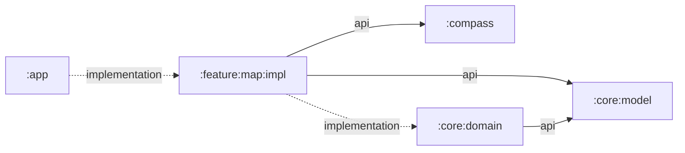

# `:feature:map:impl`

The complete map feature implementation. It owns the single Shahbaz user journey from acquiring an origin through selecting a destination, entering the drone's flight-start altitude, and presenting map, distance, connectivity, and compass state.

## Responsibilities

- Acquire precise foreground location with Google Play services and report permission, disabled-provider, timeout, and unavailable states.
- Monitor validated connectivity and reverse-geocode origin and destination names when online.
- Coordinate the standalone `:compass` lifecycle and publish complete orientation readings in feature state.
- Supply accepted location fixes to `:compass` for true-north correction, falling back to magnetic north when no valid position is available.
- Hold immutable map UI state in `MapViewModel` and expose it as `StateFlow`.
- Render OpenFreeMap/OpenStreetMap content with MapLibre Compose.
- Accept a destination by map long-press or manual decimal-degree input.
- Guide the user from destination review to a positive takeoff-altitude value in meters, with Previous navigation for destination correction.
- Preserve the altitude draft across Previous navigation, confirm valid input with the second Next action, and reset the workflow when the destination is cleared.
- Draw origin and destination markers, route geometry, WGS-84 distance, recenter controls, loading/error gates, and compass UI.
- Keep feature strings and accessibility descriptions with the feature.

The host app remains responsible for requesting Android permission and opening system settings in response to callbacks.

## Directory and package structure

| Path | Ownership |
| --- | --- |
| `src/main/kotlin/ir/hrka/shahbaz/feature/map/MapScreen.kt` | Public Compose screen and private map/overlay components. |
| `src/main/kotlin/ir/hrka/shahbaz/feature/map/MapUiState.kt` | Immutable point, location, compass-reading, flight-step, altitude-validation, and `MapUiState` contract. |
| `src/main/kotlin/ir/hrka/shahbaz/feature/map/MapViewModel.kt` | Location, compass, connectivity, geocoding, state reduction, and lifecycle coordination. |
| `src/test/kotlin/ir/hrka/shahbaz/feature/map/MapUiStateTest.kt` | Pure JVM coverage for altitude parsing and flight-step transitions. |
| `src/main/AndroidManifest.xml` | Internet/network/location permissions and the optional GPS declaration merged into the app. |
| `src/main/res/values/strings.xml` | Map and compass labels, actions, validation, loading, permission, offline, and accessibility copy. |

Consumer-facing Kotlin declarations use package `ir.hrka.shahbaz.feature.map`. The Android namespace is `ir.hrka.shahbaz.feature.map.impl`, so this module's generated resource class is `ir.hrka.shahbaz.feature.map.impl.R`.

## Public entry points

- `MapScreen(state, ...)` renders the feature and reports user/system actions through callbacks.
- `MapViewModel(application)` owns the feature state and Android-backed services.
- `MapViewModel.uiState` is the observable `StateFlow<MapUiState>`.
- `MapViewModel.onForeground()`, `onBackground()`, `onPermissionResult()`, `retryLocation()`, `setDestination()`, and `clearDestination()` handle lifecycle, recovery, and route events.
- `MapViewModel.advanceToTakeoffAltitude()`, `returnToDestinationSelection()`, `updateTakeoffAltitude()`, and `confirmTakeoffAltitude()` handle the guided altitude workflow.
- `MapUiState`, `PlacePoint`, `LocationStatus`, and `FlightSetupStep` form the screen state contract; `MapUiState.compassReading` carries the current `CompassReading` when available.
- `GeoCoordinate` comes from the transitively exposed `:core:model` API.
- `CompassReading` and its supporting orientation models come from the transitively exposed `:compass` API.

## Dependency direction



`GeoCoordinate` is exposed because it appears in screen callbacks and state. `CompassReading` is exposed through `MapUiState`, so the standalone compass library is also an `api` dependency. Geodesy and coordinate formatting remain internal through `:core:domain`. The feature does not depend on `:app` or `:core:designsystem`; it reads `MaterialTheme` supplied by its host.

## Using this module

```kotlin
dependencies {
    implementation(projects.feature.map.impl)
}
```

The Android host must:

- Merge this module's manifest so its internet, network-state, coarse-location, fine-location, and optional GPS declarations are included in the application. Gradle also merges the transitive `:compass` manifest, which owns optional compass and accelerometer declarations and adds no runtime permission.
- Create `MapViewModel` with an `Application`-aware ViewModel factory, collect `uiState`, and render `MapScreen`.
- Connect destination and altitude workflow callbacks from `MapScreen` to their matching `MapViewModel` event methods.
- Implement callbacks that request location permission and open app or device location settings.
- Forward visible/invisible lifecycle transitions through `onForeground()` and `onBackground()`.
- Provide a Material 3 theme above `MapScreen`.

See `:app`'s `MainActivity` for the canonical integration.

## Resource ownership

This module owns its internet, network-state, and location permissions; its optional GPS declaration; and all map/compass presentation copy in `src/main/res/values/strings.xml`. Add new map labels, localized direction abbreviations, error messages, content descriptions, and dialog text here. The transitive `:compass` library owns optional sensor declarations and orientation logic, but deliberately owns no UI or localized strings. This feature does not own launcher assets, application metadata, backup rules, or the platform theme. Map tiles and style data are loaded from the configured public map service rather than bundled as resources.

## Test and build

```powershell
.\gradlew.bat :feature:map:impl:testDebugUnitTest :feature:map:impl:lintDebug :feature:map:impl:assembleDebug
```

When changing the compass integration or public reading models, verify the standalone library too:

```powershell
.\gradlew.bat :compass:testDebugUnitTest :compass:lintDebug :feature:map:impl:testDebugUnitTest
```

Feature-local JVM tests cover positive meter parsing, decimal points and commas, invalid altitude input, guarded step transitions, Previous-state preservation, confirmation, and input-length limits. Pure coordinate and geodesy rules remain covered in `:core:model` and `:core:domain`; orientation math and compass models are covered in `:compass`. Permission, GPS-off, stale location, connectivity, map loading, long-press, manual entry, destination-to-altitude navigation, recenter, geocoding, and sensor/display-rotation flows should also be verified through `:app`, preferably on a physical device.
