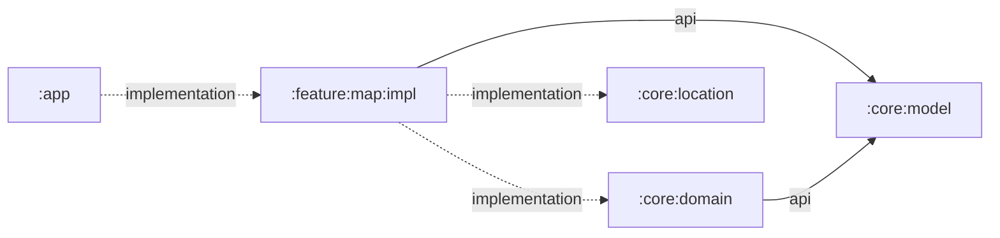

# `:feature:map:impl`

The complete map feature implementation. It owns the single Shahbaz user journey from acquiring an origin through selecting a destination and presenting map, distance, connectivity, and compass state.

## Responsibilities

- Acquire precise foreground location with Google Play services and report permission, disabled-provider, timeout, and unavailable states.
- Monitor validated connectivity and reverse-geocode origin and destination names when online.
- Coordinate heading updates through `:core:location`.
- Hold immutable map UI state in `MapViewModel` and expose it as `StateFlow`.
- Render OpenFreeMap/OpenStreetMap content with MapLibre Compose.
- Accept a destination by map long-press or manual decimal-degree input.
- Draw origin and destination markers, route geometry, WGS-84 distance, recenter controls, loading/error gates, and compass UI.
- Keep feature strings and accessibility descriptions with the feature.

The host app remains responsible for requesting Android permission and opening system settings in response to callbacks.

## Directory and package structure

| Path | Ownership |
| --- | --- |
| `src/main/kotlin/ir/hrka/shahbaz/feature/map/MapScreen.kt` | Public Compose screen and private map/overlay components. |
| `src/main/kotlin/ir/hrka/shahbaz/feature/map/MapUiState.kt` | Immutable `PlacePoint`, `LocationStatus`, and `MapUiState` contract. |
| `src/main/kotlin/ir/hrka/shahbaz/feature/map/MapViewModel.kt` | Location, connectivity, geocoding, state reduction, and lifecycle coordination. |
| `src/main/AndroidManifest.xml` | Map/network/location permissions and optional GPS/compass hardware declarations merged into the app. |
| `src/main/res/values/strings.xml` | Map labels, actions, validation, loading, permission, offline, and accessibility copy. |

Consumer-facing Kotlin declarations use package `ir.hrka.shahbaz.feature.map`. The Android namespace is `ir.hrka.shahbaz.feature.map.impl`, so this module's generated resource class is `ir.hrka.shahbaz.feature.map.impl.R`.

## Public entry points

- `MapScreen(state, ...)` renders the feature and reports user/system actions through callbacks.
- `MapViewModel(application)` owns the feature state and Android-backed services.
- `MapViewModel.uiState` is the observable `StateFlow<MapUiState>`.
- `MapViewModel.onForeground()`, `onBackground()`, `onPermissionResult()`, `retryLocation()`, `setDestination()`, and `clearDestination()` are the host event surface.
- `MapUiState`, `PlacePoint`, and `LocationStatus` form the screen state contract.
- `GeoCoordinate` comes from the transitively exposed `:core:model` API.

## Dependency direction



`GeoCoordinate` is exposed because it appears in screen callbacks and state. Calculation and sensor implementations remain internal dependencies. The feature does not depend on `:app` or `:core:designsystem`; it reads `MaterialTheme` supplied by its host.

## Using this module

```kotlin
dependencies {
    implementation(projects.feature.map.impl)
}
```

The Android host must:

- Merge this module's manifest so its internet, network-state, coarse-location, and fine-location permissions are included in the application.
- Create `MapViewModel` with an `Application`-aware ViewModel factory, collect `uiState`, and render `MapScreen`.
- Implement callbacks that request location permission and open app or device location settings.
- Forward visible/invisible lifecycle transitions through `onForeground()` and `onBackground()`.
- Provide a Material 3 theme above `MapScreen`.

See `:app`'s `MainActivity` for the canonical integration.

## Resource ownership

This module owns its permissions, optional GPS/compass hardware declarations, and all map-feature copy in `src/main/res/values/strings.xml`. Add new map labels, error messages, content descriptions, and dialog text here. It does not own launcher assets, application metadata, backup rules, or the platform theme. Map tiles and style data are loaded from the configured public map service rather than bundled as resources.

## Test and build

```powershell
.\gradlew.bat :feature:map:impl:testDebugUnitTest :feature:map:impl:lintDebug :feature:map:impl:assembleDebug
```

There are currently no feature-local test sources. Pure coordinate and geodesy rules are covered in `:core:model` and `:core:domain`; permission, GPS-off, stale location, connectivity, map loading, long-press, manual entry, recenter, geocoding, and compass flows should be verified through `:app`, preferably on a physical device.
