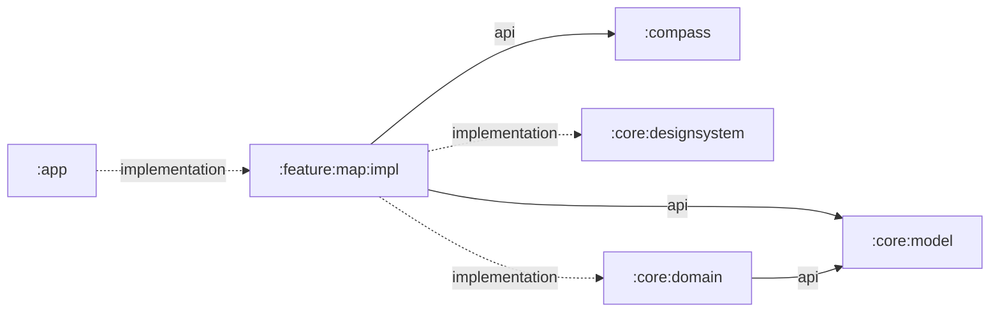

# `:feature:map:impl`

The complete map feature implementation. It owns the single Shahbaz user journey from acquiring an origin through selecting a destination, entering the cruise and destination-ground altitude profile, and presenting map, distance, connectivity, and compass state.

## Responsibilities

- Acquire precise foreground location with Google Play services and report permission, disabled-provider, timeout, and unavailable states.
- Monitor validated connectivity and reverse-geocode origin and destination names when online.
- Coordinate the standalone `:compass` lifecycle and publish complete orientation readings in feature state.
- Publish typed compass lifecycle/failure state, including first-sample no-response and stale-stream
  detection, plus typed provider-supplied GPS speed availability.
- Supply accepted location fixes to `:compass` for true-north correction, falling back to magnetic north when no valid position is available.
- Hold immutable map UI state in `MapViewModel` and expose it as `StateFlow`.
- Render OpenFreeMap/OpenStreetMap content with MapLibre Compose using Android's compatibility
  `TextureView` renderer so returning from another map-bearing destination creates a valid surface.
- Accept a destination by map long-press or manual decimal-degree input.
- Guide the user from destination review to a positive cruise altitude above takeoff and a signed
  destination-ground elevation relative to takeoff. Zero ground elevation means both surfaces are
  level, and confirmation fails closed unless ground remains strictly below cruise altitude. The
  ground value is a manual fallback for unavailable trusted terrain/range data, not landing proof.
- Preserve both altitude drafts across Previous navigation. Replacing a destination retains the
  reusable cruise draft but clears its destination-specific ground elevation; clearing the
  destination clears both.
- Snapshot the live origin, destination, and valid altitude profile into an immutable `FlightPlan`
  with the second Next action. Invalidate that plan when its route or either altitude changes while
  allowing live origin updates to continue independently from the fixed confirmed origin.
- Draw origin and destination markers, route geometry, WGS-84 distance, recenter controls,
  loading/error gates, and the shared magnetic compass UI, while tracing map composition, style
  attachment, completion, failure, and timeout events in the flight black box.
- Keep feature strings and accessibility descriptions with the feature.

The host app remains responsible for requesting Android permission and opening system settings in response to callbacks.

## Directory and package structure

| Path | Ownership |
| --- | --- |
| `src/main/kotlin/ir/hrka/shahbaz/feature/map/MapScreen.kt` | Public Compose screen and private map/overlay components. |
| `src/main/kotlin/ir/hrka/shahbaz/feature/map/MapUiState.kt` | Immutable point, location, speed/compass status, flight-plan confirmation, altitude-validation, and `MapUiState` contract. |
| `src/main/kotlin/ir/hrka/shahbaz/feature/map/MapViewModel.kt` | Location, compass, connectivity, geocoding, state reduction, and lifecycle coordination. |
| `src/test/kotlin/ir/hrka/shahbaz/feature/map/MapUiStateTest.kt` | Pure JVM coverage for altitude parsing and flight-step transitions. |
| `src/main/AndroidManifest.xml` | Internet/network/location permissions and the optional GPS declaration merged into the app. |
| `src/main/res/values/strings.xml` | Map and compass labels, actions, validation, loading, permission, offline, and accessibility copy. |

Consumer-facing Kotlin declarations use package `ir.hrka.shahbaz.feature.map`. The Android namespace is `ir.hrka.shahbaz.feature.map.impl`, so this module's generated resource class is `ir.hrka.shahbaz.feature.map.impl.R`.

## Public entry points

- `MapScreen(state, ...)` renders the feature and reports user/system actions through callbacks.
- `MapViewModel(application)` owns the feature state and Android-backed services.
- `MapViewModel.uiState` is the observable `StateFlow<MapUiState>`.
- `MapViewModel.onForeground()`, `onBackground()`, `onPermissionResult()`, `retryLocation()`, `setDestination()`, and `clearDestination()` handle lifecycle, recovery, and route events.
- `MapViewModel.advanceToCruiseAltitude()`, `returnToDestinationSelection()`,
  `updateCruiseAltitude()`, `updateDestinationGroundAltitude()`, `confirmCruiseAltitude()`, and
  `clearConfirmedFlightPlan()` handle setup confirmation and dashboard return.
- `MapUiState`, `PlacePoint`, `PhoneLocationFix`, `LocationStatus`, `PhoneSpeedStatus`,
  `CompassSensorStatus`, and `FlightSetupStep` form the screen state contract. `MapUiState.origin`
  remains the live phone position; `PhoneLocationFix` retains the accepted sample's monotonic
  acquisition time and accuracy for flight consumers; `confirmedFlightPlan` contains the fixed
  accepted setup snapshot.
- `GeoCoordinate` and `FlightPlan` come from the transitively exposed `:core:model` API.
- `CompassReading` and its supporting orientation models come from the transitively exposed `:compass` API.

## Dependency direction



`GeoCoordinate` and `FlightPlan` are exposed because they appear in screen callbacks or state. Compass readings, sources, and typed failures are exposed through `MapUiState`, so the standalone compass library is also an `api` dependency. Geodesy and coordinate formatting remain internal through `:core:domain`. The reusable animated dial comes from `:core:designsystem`; the feature does not depend on `:app`.

## Using this module

```kotlin
dependencies {
    implementation(projects.feature.map.impl)
}
```

The Android host must:

- Merge this module's manifest so its internet, network-state, coarse-location, fine-location, and optional GPS declarations are included in the application. Gradle also merges the transitive `:compass` manifest, which owns optional compass and accelerometer declarations and adds no runtime permission.
- Create `MapViewModel` with an `Application`-aware ViewModel factory, collect `uiState`, and render `MapScreen`.
- Connect destination and altitude workflow callbacks from `MapScreen` to their matching `MapViewModel` event methods.
- Implement callbacks that request location permission and open app or device location settings.
- Forward visible/invisible lifecycle transitions through `onForeground()` and `onBackground()`.
- Provide a Material 3 theme above `MapScreen`.

The operator is not asked for absolute launch altitude, QNH, motion-profile speeds, accelerations,
controller gains, or wind thresholds. The origin binds to the accepted live position; aircraft
policy owns those other values. After confirmation, the dashboard's Start action submits the
immutable plan to autopilot preflight. It does not convert map input directly into an arm or motor
command.

See `:app`'s `MainActivity` for the canonical integration.

## Resource ownership

This module owns its internet, network-state, and location permissions; its optional GPS declaration; and map/compass accessibility copy in `src/main/res/values/strings.xml`. The transitive `:compass` library owns optional sensor declarations and orientation logic, while `:core:designsystem` owns the reusable Canvas dial. This feature does not own launcher assets, application metadata, backup rules, or the platform theme. Map tiles and style data are loaded from the configured public map service rather than bundled as resources.

## Test and build

```powershell
.\gradlew.bat :feature:map:impl:testDebugUnitTest :feature:map:impl:lintDebug :feature:map:impl:assembleDebug
```

When changing the compass integration or public reading models, verify the standalone library too:

```powershell
.\gradlew.bat :compass:testDebugUnitTest :compass:lintDebug :feature:map:impl:testDebugUnitTest
```

Feature-local JVM tests cover positive cruise and signed ground-elevation parsing, strict altitude
ordering, guarded step transitions, draft retention/reset rules, fixed flight-plan snapshots,
live-origin independence, confirmation invalidation, speed-value invariants, and input-length
limits. Pure coordinate, flight-plan, and geodesy rules remain covered in `:core:model` and
`:core:domain`; orientation math and compass models are covered in `:compass`. Permission,
GPS-off, speed availability, stale location, connectivity, map loading, navigation, geocoding, and
sensor/display-rotation flows should also be verified through `:app`, preferably on a physical
device.
